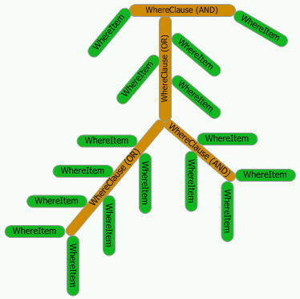

# QuickWhere: create complex forms for searching into databases (2004)

This is re-upload from [codeproject.com](https://www.codeproject.com/Articles/6155/QuickWhere-create-complex-forms-for-searching-into)

### The problem

You create applications that work with databases. How many times you had to create forms for searching the database for records that meet user defined criteria? If you have developed such forms, you probably know this could be painful. Painful to check if the user made an entry in each of all these numerous text boxes, combo-boxes, etc. Painful - when the new project manager decides that that tables and fields in the database do not obey his naming convention. And especially painful when the client needs a 'small' change in the searching capabilities of your application - he wants only two more text boxes on the form to be used as searching criteria.

What do you do if your form for search has already 5 fields? What about 20?

I have seen the code of one function that was 25 screens long and it returned only the `WHERE` clause of one SQL expression. This function looped over the controls on the searching form checking if there is a user entry. It collected values of the controls generating a string - the `WHERE` clause. This was a large clause - with about 45 fields and complex variations of `AND`s and `OR`s. No one wanted to touch this procedure after it was initially created and tested. There were a number of such searching forms. (The design of the database is out of question here.)

### The solution

At least for VB.NET, `QuickWhere` component solves these painful problems by encapsulating this functionality. You just attach any number of controls to an instance of QuickWhere and it generates the correct `WHERE` clause, which you can use further for `SELECT`s, `DELETE`s, etc.

You can use `QuickWhere` to save the user entries as filter and later to use the saved filter to load searching criteria.

### Using the code: simple example

You have completed the visual design of your searching form. How do you get the `WHERE` clause?


Create an instance of `QuickWhere` and attach controls to it:

```vb
Dim QW As New QuickWhere()
With QW
    .Controls.Add("SearchField1", "Table1", TypeOfValues.StringType, _
                              WhereConditions.BeginsWith, TextBox1)
    .Controls.Add("SearchField2", TypeOfValues.DateType, DateTimePicker1)
    MsgBox(.GetSql)                
End With
```

If `TextBox1.Text` is `someStringValue` and 22 May 1987 is the date selected in `DateTimePicker1`, the generated `WHERE` clause will be as follows:

```sql
([Table1].[SearchField1] LIKE "someStringValue*") 
                        AND ([SearchField2] = #22/05/87#)
```

The generated string does not contain the word `WHERE` to allow you using it in further more complex expressions.

You do not need to think how to wrap strings into apostrophes, the dates into pound signs, field names into square brackets, etc. `QuickWhere` takes care of all these.

### Other examples

The second example gives you the idea how to attach various Win controls to `QuickWhere`. Each control represents a different type of field - string, date, numeric, boolean. This example also shows how to save the user input to a file as filter for further use as well as how to load such a filter.


Here is the code for attaching controls in the second example:

```vb
With QW
  .Add("Field1", WhereConditions.Contains, TypeOfValues.StringType, ListBox1)
  .Add("Field2", WhereConditions.GreaterOrEqual, _
             TypeOfValues.NumericType, ComboBox1)
  .Add("Field3", TypeOfValues.BooleanType, ComboBox2)
  .Add("Field4", "TableName1", TypeOfValues.DateType, _
             WhereConditions.Between, MonthCalendar1, MonthCalendar1)
  .Add("Field5", "TableName2", TypeOfValues.NumericType, _
             WhereConditions.NotBetween, TextBox1, TextBox2)
End With
```

The third example is more advanced. It shows you how to define complex `WHERE` clauses that include mixed `AND`s and `OR`s. You can achieve this in various ways. This example presents two such ways. This third example shows you also how to apply operations over the values and how to use the `IN` clause.

The fourth example demonstrates how the general settings of `QuickWhere` reflect the generated `WHERE` clause. The general settings define the string and date markers, string delimiter etc. By changing this general settings, you can adjust the generated `WHERE` clause for the syntax of various databases. For example, the wild card char in SQL Server is the percent sign '`%`' and the wild card char in MS Access is the star symbol '`*`'. The default settings are for MS Access.

### How it works

The implementation of the `QuickWhere` components is based on the `WhereItem` and `WhereClause` classes.

#### The basic classes

To understand the two basic classes, think of a `WHERE` clause as a tree with one or more branches. Each branch has one or more leaves. Each leaf is one `WhereItem`. The branches are presented by the `WhereClause` class. Any branch (`WhereClause`) by itself could have other sub-branches.



Both classes implement the `IWhereEntity` interface. This interface provides `GetSql` method. When `GetSql` is invoked for the root `WhereClause`, it navigates down through all its branches and/or leaves (`WhereItem`s) invoking their respective `GetSql` methods and collects their partial `WHERE` clauses. Finally, the root `WhereClause` combines the collected `WHERE` clauses to generates its output.

The `WhereItem` is the class that actually generates the primary `WHERE` clauses. It has two values - the properties `Value` and `Value2`. This allows you to use the `BETWEEN` condition in the `WHERE` clause. When condition is `BETWEEN` and one of the values is blank, the `WhereItem` converts the condition into proper `GreaterOrEquial`or `LessOrEqual` conditions. If the condition is `IS NULL`, both `Value` and `Value2` properties are ignored.


You can use the basic classes `WhereItem` and `WhereClause` to create '`WHERE` trees' with level of complexity you need:

```vb
Dim wiFirstName As New WhereItem()
Dim wiLastName As New WhereItem()
Dim wiDepartment As New WhereItem()
Dim wiSale As New WhereItem()
Dim wiSaleDate As New WhereItem()
Dim wcSearchByName As New WhereClause()
Dim wcSearchBySale As New WhereClause()
Dim wcFinalSearch As New WhereClause()

' The default WhereCondition is WhereConditions.EqualTo
' The default ValueType is TypeOfValues.StringType

With wiFirstName
    .FieldName = "FirstName"
    .TableName = "Personnel"
    .Value = "John"
End With

With wiLastName
    .FieldName = "LastName"
    .TableName = "Personnel"
    .Value = "son"
    .WhereCondition = WhereConditions.EndsWith
End With

With wiDepartment
    .FieldName = "DepartmentID"
    .TableName = "Departments"
    .Value = "9"
    .ValueType = TypeOfValues.NumericType
End With

' The default Operators is Operators.AndOperator
wcSearchByName.Add(wiFirstName)
wcSearchByName.Add(wiLastName)
wcSearchByName.Add(wiDepartment)


With wiSale
    .FieldName = "Sale"
    .Value = "15000"
    .TableName = "Sales"
    .ValueType = TypeOfValues.NumericType
    .WhereCondition = WhereConditions.GreaterOrEqual
End With

With wiSaleDate
    .FieldName = "SaleDate"
    .TableName = "Sales"
    .Value = "01/10/87"
    .Value2 = "25/10/87"
    .ValueType = TypeOfValues.DateType
    .WhereCondition = WhereConditions.Between
End With
wcSearchBySale.Add(wiSale)
wcSearchBySale.Add(wiSaleDate)


wcFinalSearch.Add(wcSearchByName)
wcFinalSearch.Add(wcSearchBySale)

MsgBox(wcFinalSearch.GetSql(Operators.OrOperator))
```

The generated `WHERE` clause is:

```sql
(([Personnel].[FirstName] = "John") AND ([Personnel].[LastName] LIKE "*son") 
  AND ([Departments].[DepartmentID] = 9)) OR 
(([Sales].[Sale] >= 15000) AND ([Sales].[SaleDate] 
  BETWEEN #01/10/87# AND #25/10/87#))
```

#### The derived classes

The `WhereControl` class inherits from the `WhereItem`. You can attach zero, one, or two Windows controls to one `WhereControl`. Why zero or two? Just like with the `WhereItem` class - to allow for the `WHERE` condition to be `IS NULL`, `BETWEEN` and their negatives.


The `QuickWhere` is a collection of `WhereControl`s. The `QuickWhere` class provides shared methods for saving to and loading from a file. This frees you from the obligation to write your own code for saving and loading the user input as predefined filters. This is useful when there are a number of search fields and the user wants to repeat the same search over the time without typing every time. The loading and saving are straightforward.

```vb
' Saving a filter to file QuickWhereFilter.xml
Dim QW As New QuickWhere()
With QW
    .Controls.Add("SearchField1", "Table1", TypeOfValues.StringType, _
                       WhereConditions.BeginsWith, TextBox1)
    .Controls.Add("SearchField2", TypeOfValues.DateType, DateTimePicker1)
    .SaveFilter(APP_PATH & "\QuickWhereFilter.xml", QW)
End With
```

```vb
' Loading a filter from file QuickWhereFilter.xml
Dim QW As New QuickWhere()
With QW
    ' it is necessary to set the form which controls belong to
    QW.ParentForm = Me
    QW.LoadFilter(APP_PATH & "\QuickWhereFilter.xml", Me)
End With
```

Note that `WhereClause` is a method of `QuickWhere` and it always returns a fresh new instance of the `WhereClause` class.

### More features

#### Operations over values

It may happen that you will need to compare a field with the result of certain operation over a value. For example, the result of the operation over the value could be User Defined Function in SQL Server.

```vb
Dim QW As New QuickWhere()

indValueOperation = QW.Add("Field2", TextBox1)
QW(indValueOperation).ValueOperation = "Mid(@@,2,3)"
```

If the text of `TextBox1` is `someTextValue`, the generated `WHERE` clause will be:

```sql
([Field2] = Mid("someTextValue",2,3))
```

The literal `@@` is the value of the shared property `Replacement` of `QuickWhere`.

#### Attaching ListBox and ComboBox controls

When you attach `ListBox` or `ComboBox` controls to `QuickWhere`, you may need to use the index of the selected list item instead of the text of the control. To accomplish this, set the property `SelectedValueIsUsed` of the `WhereControl` to `True`.

```vb
Dim tmpIndex As Integer

tmpIndex = .Add("DepartmentID", TypeOfValues.NumericType, cmbDepartment)
.Item(tmpIndex).SelectedValueIsUsed = True
```

`SelectedValueIsUsed` property is ignored for controls other than `ListBox`, `ComboBox` and `CheckedListBox`.

#### Extending QuickWhere

As for now, the following Win controls could be attached to `QuickWhere`:

- `TextBox`
- `ComboBox`
- `ListBox`
- `CheckedListBox`
- `CheckBox`
- `RadioButton`
- `DateTimePicker`
- `MonthCalendar`
- `DomainUpDown`
- `NumericUpDown`

If you want to extend the list of supported controls, add the necessary code into both procedures `GetControlText` and `SetControlText` of `WhereControl` class.

If you need `QuickWhere` to support various SQL dialects, use the shared method `SetGenerals` to specify the string and date markers, etc. If this is not enough, change the implementation of `GetSql` method of the WhereItem class to fit your needs.

### Warning

One may ask "What about the validation of the user input in the search controls?" `QuickWhere` **does not validate the user input**. It was never meant to. As such, it **it is  vulnerable to injection attacks.** 

*Disclaimer: None of the presented sample forms implies for good visual design - they serve as illustrations only.*
